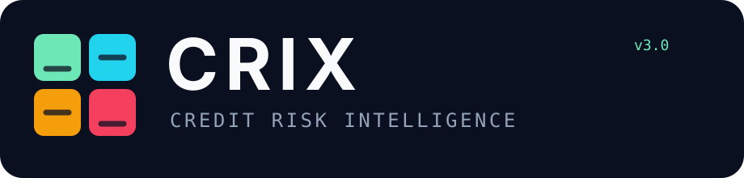

<p align="center">
  
</p>

# CRIX — Credit Risk Intelligence API

CRIX is a **backend-only, stateless credit-risk decisioning and model-risk API**. v3 replaces the original synthetic champion with **CRIX-MonoBoost 2.0**, trained, calibrated and evaluated on real resolved LendingClub originations curated to application-time-only variables.

The model is the product; HTTP + OpenAPI are the interface.

> **Model semantics:** `pd` in v3 is **final-loan-resolution default risk**, not a 12-month regulatory PD. CRIX remains a public engineering/model-risk demonstration and is not approved for real consumer-credit decisions.

## Live API

- Base URL: `https://crix-credit-risk-intelligence.onrender.com`
- Swagger UI: `https://crix-credit-risk-intelligence.onrender.com/docs`
- OpenAPI JSON: `https://crix-credit-risk-intelligence.onrender.com/openapi.json`
- Health: `https://crix-credit-risk-intelligence.onrender.com/health`
- Readiness: `https://crix-credit-risk-intelligence.onrender.com/ready`

## v3: real-world training and adaptation

### Primary champion — LendingClub / Zenodo

CRIX-MonoBoost 2.0 is trained from the open **Lending Club loan dataset for granting models**, specifically curated to remove post-underwriting leakage and retain variables known at application time.

- Source rows: **1,347,681**
- CRIX-harmonized rows: **1,269,389**
- Period: **2007–2018**
- DOI: `10.5281/zenodo.11295916`
- Source MD5: `b019384d6bc65bf2a3e839362e4ff502`
- Train: originations through **2015**
- Calibration: **2016** originations
- Out-of-time test: **2017** originations
- 2018 is excluded from the primary reported evaluation to reduce final-status maturation bias.

Champion feature contract:

| CRIX feature | Source | Constraint |
|---|---|---|
| `debtToIncome` | `dti_n`, normalized to a ratio | risk non-decreasing |
| `loanToIncome` | `loan_amnt / revenue` | risk non-decreasing |
| `creditScore` | `fico_n` | risk non-increasing |
| `employmentYears` | normalized `emp_length` | risk non-increasing |

The remaining API fields can still drive policy, stress testing, confidence context and deterministic LGD logic. CRIX does **not** claim they were champion training features when the public cohort does not contain them.

### External real-world adaptation layers

CRIX deliberately does not concatenate incompatible products/targets merely to increase row count.

- **UCI Default of Credit Card Clients (Taiwan)** — separate reduced-feature behavioral model using six-month utilization, payment behavior and balance-growth signals. Identity/protected-attribute-adjacent fields are excluded. The target is next-month card default, so this artifact is research-only and does not alter the LendingClub personal-loan PD.
- **UCI Statlog German Credit** — structural benchmark only; overlap is limited to loan duration/amount, employment band, installment burden and same-bank credit count.
- **UCI South German Credit** — preferred corrected companion benchmark because UCI documents coding issues in the legacy Statlog representation.

See [`model/EXTERNAL_BENCHMARKS.md`](./model/EXTERNAL_BENCHMARKS.md) and the committed benchmark artifacts for exact results and provenance.

### Sources registered but not silently used

Home Credit, Give Me Some Credit, FICO HELOC, Freddie Mac and Fannie Mae remain in the dataset registry with their access/product constraints. Gated sources are not represented as having been trained on until the data is actually obtained under the applicable terms.

## Primary out-of-time diagnostics

| Diagnostic | 2017 OOT value |
|---|---:|
| ROC-AUC | **0.6594** |
| KS statistic | **0.2300** |
| Brier score | **0.1645** |
| Log loss | **0.5043** |
| Test observations | **157,119** |
| Test default rate | **22.42%** |
| Logistic challenger ROC-AUC | **0.6578** |

These are deliberately reported as model diagnostics, not a cosmetic “accuracy” score.

## What the engine returns

Each score includes:

- calibrated final-resolution default probability and explicit `pdHorizon`;
- real-data logistic challenger probability;
- champion/challenger disagreement;
- confidence and model-risk flags;
- out-of-distribution signals derived from real training support;
- LGD, EAD and `Expected Loss = PD × LGD × EAD`;
- 300–850 CRIX score and risk grade;
- local counterfactual reason codes;
- indicative risk-based APR;
- independent `APPROVE`, `REVIEW`, or `DECLINE` policy result;
- model and policy versions.

The statistical model estimates risk. The policy layer decides what to do with that risk.

## API surface

| Method | Path | Purpose |
|---|---|---|
| `GET` | `/` | API discovery document |
| `GET` | `/health` | Liveness probe |
| `GET` | `/ready` | Model-integrity/readiness probe |
| `GET` | `/docs` | Interactive Swagger UI |
| `GET` | `/openapi.json` | OpenAPI document |
| `GET` | `/api/v3/model` | Model target, provenance, diagnostics and policy metadata |
| `POST` | `/api/v3/risk/score` | Score one application |
| `POST` | `/api/v3/risk/stress` | Re-score under mild/severe deterministic stress |
| `POST` | `/api/v3/risk/batch` | Score up to 50 applications synchronously |

Package/API release: **3.0.0**. Bundled primary model: **CRIX-MonoBoost 2.0.0**.

## Quick start

Requirements: **Node.js 22+** and npm.

```bash
git clone https://github.com/wbizmo/credit-risk-intelligence-dashboard.git
cd credit-risk-intelligence-dashboard
npm install
npm run dev
```

Useful local URLs:

```text
http://localhost:3000/health
http://localhost:3000/ready
http://localhost:3000/docs
http://localhost:3000/openapi.json
```

### Score an application

```bash
curl -X POST http://localhost:3000/api/v3/risk/score \
  -H 'content-type: application/json' \
  -d '{
    "applicationId": "demo-001",
    "annualIncome": 85000,
    "debtToIncome": 0.28,
    "creditScore": 720,
    "creditUtilization": 0.30,
    "delinquencies24m": 0,
    "inquiries6m": 1,
    "oldestTradeMonths": 96,
    "openAccounts": 7,
    "loanAmount": 24000,
    "termMonths": 36,
    "employmentYears": 5,
    "cashBufferMonths": 3,
    "onTimePaymentRate": 0.98,
    "incomeStability": 0.82,
    "recentCreditGrowth": 0.08
  }'
```

If `CRIX_API_KEY` is configured, add `-H 'x-api-key: your-key'`.

## Model development

Python is offline/build-time only. The live API does **not** run Python or call an external inference service.

```bash
python -m venv model/.venv
# activate the environment for your OS
pip install -r model/requirements.txt
python model/train.py
python model/benchmark_external.py
```

The training workflows download/verify public source data, harmonize fields, train/evaluate the primary model and independent research benchmarks, then commit compact JSON artifacts under `model/artifacts/`. The TypeScript runtime evaluates the primary artifact directly.

## Security and resilience

- strict request JSON schemas and `additionalProperties: false`;
- bounded numeric domains and synchronous batch size;
- 64 KiB body ceiling;
- per-request UUIDs returned as `x-request-id`;
- Helmet security headers;
- global and endpoint-specific rate limits;
- optional API-key authentication using constant-time comparison;
- CORS disabled unless explicitly allow-listed;
- credential-header log redaction;
- sanitized errors;
- finite-number checks inside the engine;
- bounded model-tree traversal and artifact integrity checks;
- readiness sentinel scoring;
- no database and no application persistence;
- no borrower-name field;
- protected-attribute-adjacent UCI fields explicitly excluded from adaptation models.

See [`SECURITY.md`](./SECURITY.md), [`ARCHITECTURE.md`](./ARCHITECTURE.md), [`MODEL_CARD.md`](./MODEL_CARD.md), and [`model/TRAINING_REPORT.md`](./model/TRAINING_REPORT.md).

## Architecture

```text
HTTP client
   ↓
Fastify 5
   ├─ validation / limits / optional API key
   ├─ health + readiness
   ├─ Swagger / OpenAPI
   └─ /api/v3 risk routes
          ↓
CRIX TypeScript risk engine
   ├─ real-data calibrated monotonic champion
   ├─ exported real-data logistic challenger
   ├─ OOD + confidence / disagreement checks
   ├─ LGD / EAD / expected loss
   ├─ local reason codes
   ├─ independent policy engine
   └─ deterministic stress engine
          ↓
versioned model artifact

Offline research boundary
   ├─ LendingClub/Zenodo primary training + OOT validation
   ├─ UCI Taiwan reduced-feature behavioral adaptation
   ├─ UCI German structural benchmarks
   └─ gated-source registry for future product-specific work
```

No PostgreSQL, Redis, Python inference service or paid AI API is required at runtime.

## Disclaimer

Training on real data is a meaningful upgrade, but it does **not** make CRIX a production-approved lending model. Production use still requires representative institution-specific data, exact target/window governance, independent validation, fairness/proxy testing, legal/compliance review, governed adverse-action reasons, monitoring, recalibration, auditable authentication/authorization and formal model-risk approval. The public demo must not receive real consumer credit data.

## License

MIT. Third-party datasets retain their own licenses and citation requirements; dataset provenance is recorded in the model artifacts and reports.
